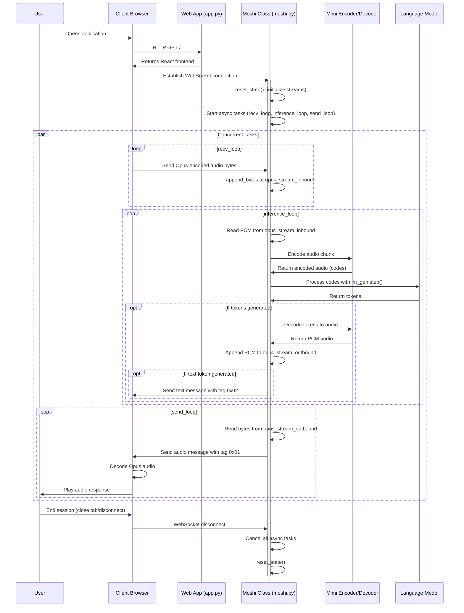

```mermaid
sequenceDiagram
    participant User
    participant Browser as Client Browser
    participant WebApp as Web App (app.py)
    participant Moshi as Moshi Class (moshi.py)
    participant MimiModel as Mimi Encoder/Decoder
    participant LangModel as Language Model
    
    User->>Browser: Opens application
    Browser->>WebApp: HTTP GET /
    WebApp->>Browser: Returns React frontend
    
    Browser->>Moshi: Establish WebSocket connection
    activate Moshi
    Moshi->>Moshi: reset_state() (initialize streams)
    Moshi->>Moshi: Start async tasks (recv_loop, inference_loop, send_loop)
    
    par Concurrent Tasks
        loop recv_loop
            Browser->>Moshi: Send Opus-encoded audio bytes
            Moshi->>Moshi: append_bytes to opus_stream_inbound
        end
        
        loop inference_loop
            Moshi->>Moshi: Read PCM from opus_stream_inbound
            Moshi->>MimiModel: Encode audio chunk
            MimiModel->>Moshi: Return encoded audio (codes)
            Moshi->>LangModel: Process codes with lm_gen.step()
            LangModel->>Moshi: Return tokens
            opt If tokens generated
                Moshi->>MimiModel: Decode tokens to audio
                MimiModel->>Moshi: Return PCM audio
                Moshi->>Moshi: Append PCM to opus_stream_outbound
                
                opt If text token generated
                    Moshi->>Browser: Send text message with tag 0x02
                end
            end
        end
        
        loop send_loop
            Moshi->>Moshi: Read bytes from opus_stream_outbound
            Moshi->>Browser: Send audio message with tag 0x01
            Browser->>Browser: Decode Opus audio
            Browser->>User: Play audio response
        end
    end
    
    User->>Browser: End session (close tab/disconnect)
    Browser->>Moshi: WebSocket disconnect
    Moshi->>Moshi: Cancel all async tasks
    Moshi->>Moshi: reset_state()
    deactivate Moshi
```    
